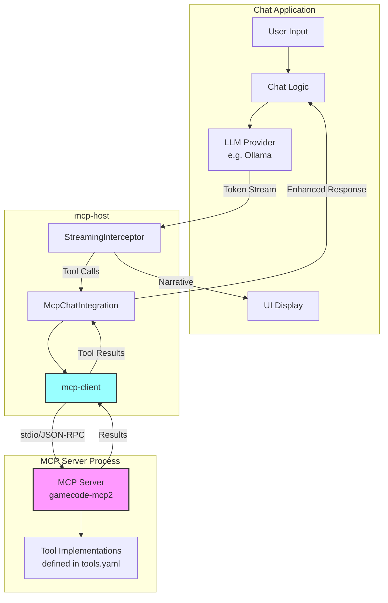
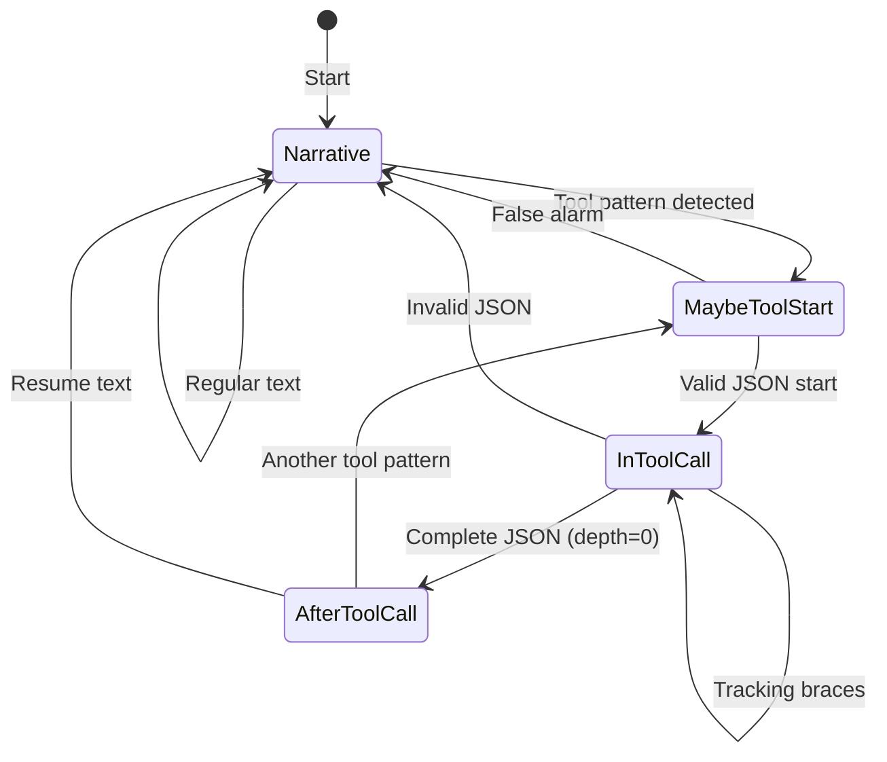

# MCP-Host

A streaming-aware integration layer for adding Model Context Protocol (MCP) tool support to chat applications.

## Overview

`mcp-host` enables chat applications to seamlessly integrate MCP tools while maintaining full control over their LLM interactions. It provides intelligent streaming interception to identify and execute tool calls without disrupting the user experience.

The architecture consists of three layers:
1. **mcp-host**: Streaming interceptor and integration layer
2. **mcp-client**: Manages the MCP server process lifecycle and JSON-RPC communication
3. **MCP Server**: The actual tool server (e.g., gamecode-mcp2) running as a subprocess

When initialized, mcp-client spawns the MCP server as a subprocess and communicates with it via stdio using JSON-RPC 2.0. This keeps tool execution isolated and secure.

## Key Features

- **Streaming-aware**: Process tokens in real-time without blocking
- **Smart buffering**: Automatically detect and extract tool calls
- **Multiple modes**: Choose between smart buffering, passthrough, or placeholder modes
- **Tool execution**: Execute MCP tools transparently in the background
- **Instrumentation**: Built-in debugging and performance monitoring
- **Chat app friendly**: Designed to integrate with existing chat architectures

## Architecture



## Quick Start

```rust
use gamecode_mcp_host::{
    McpChatIntegration, ChatIntegrationConfig, StreamingMode,
    ProcessedToken, InstrumentationConfig,
};

// Initialize MCP client
let mcp_client = Arc::new(Mutex::new(
    gamecode_mcp_client::McpClient::connect("path/to/mcp-server", &[]).await?
));

// Configure integration
let config = ChatIntegrationConfig {
    streaming_mode: StreamingMode::SmartBuffering { max_buffer_chars: 150 },
    enhance_system_prompts: true,
    max_tool_rounds: 3,
    instrumentation: InstrumentationConfig {
        log_path: Some("mcp_debug.log".to_string()),
        log_token_classifications: false,
        log_performance_metrics: true,
    },
};

// Create integration
let integration = McpChatIntegration::new(mcp_client, config).await?;

// Process streaming response
let mut handle = integration.process_streaming_response(token_stream).await?;

// Handle tokens
while let Some(token) = handle.token_stream.recv().await {
    match token {
        ProcessedToken::Narrative(text) => {
            // Display to user
        }
        ProcessedToken::ToolCall(_) => {
            // Hidden from user
        }
        ProcessedToken::Buffered(_) => {
            // Still being analyzed
        }
    }
}

// Handle tool executions
while let Some(tool) = handle.tool_stream.recv().await {
    println!("Tool {} executed in {}ms", tool.tool_name, tool.execution_time_ms);
}
```

## Streaming Modes

### Smart Buffering (Default)
Intelligently detects tool calls in the stream and extracts them for execution while passing narrative text through immediately.

### Passthrough
No processing - all tokens pass through unchanged. Use when you want MCP connectivity but handle tools differently.

### With Placeholders
Replace tool calls with user-friendly placeholder text while still executing tools in the background.

## State Machine Design

The streaming interceptor uses a state machine to classify tokens:



## Examples

See the [examples directory](../examples/) for complete working examples:

- `minimal_streaming.rs` - Basic integration
- `streaming_chat_app.rs` - Full chat application
- `passthrough_mode.rs` - No interception mode
- `placeholder_mode.rs` - User-friendly placeholders
- `instrumentation_demo.rs` - Debug logging

## Documentation

- [Streaming Architecture](docs/streaming-architecture.md) - Detailed explanation of the streaming system
- [Implementation Details](docs/implementation-diagram.md) - Internal type architecture and data flow

## Integration with Chat Applications

The key insight: Chat applications need to maintain control of their LLM integration while adding tool support. This crate provides that capability without requiring changes to existing chat architectures.

Your chat app continues to:
- Manage conversation history
- Control LLM parameters
- Handle authentication
- Manage context windows

`mcp-host` adds:
- Transparent tool detection
- Automatic tool execution
- Result integration
- Debug instrumentation

## Performance

- **Minimal latency**: Narrative text passes through immediately
- **Concurrent execution**: Tools run in parallel with token display
- **Bounded memory**: Buffer size limits prevent unbounded growth
- **Single-pass parsing**: O(n) complexity for token classification

## Future Enhancements

- [ ] Streaming tool results back into the response
- [ ] Tool call validation and sandboxing
- [ ] Response caching for identical tool calls
- [ ] Model-specific prompt optimization
- [ ] WebAssembly support for browser integration