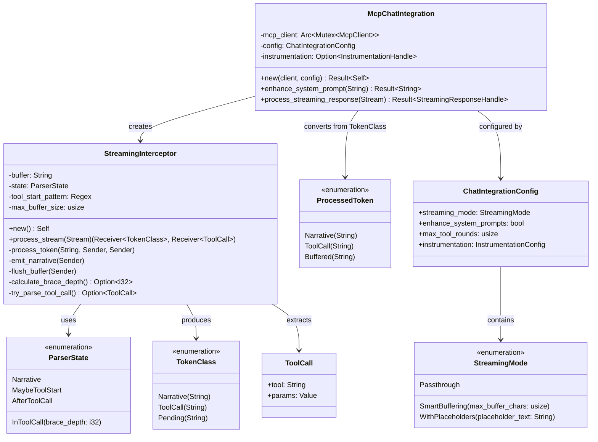
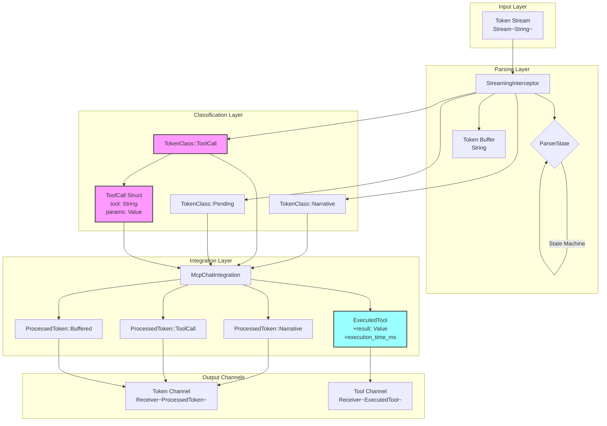
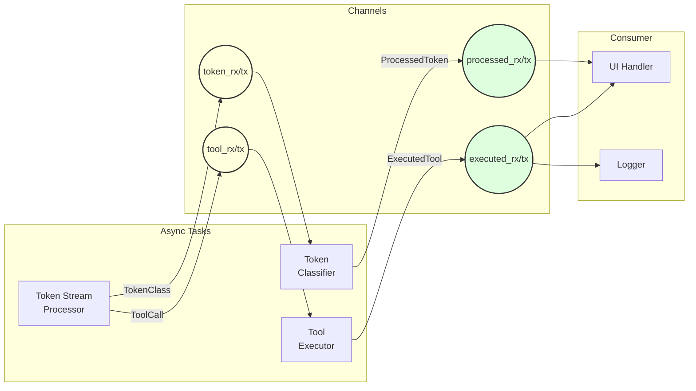

# Implementation Details

## Rust Type Architecture



## Data Flow Through Types



## State Transition Implementation

```rust
// Simplified view of state transitions
match &self.state {
    ParserState::Narrative => {
        if self.tool_start_pattern.is_match(&self.buffer) {
            self.state = ParserState::MaybeToolStart;
        } else if self.buffer.len() > self.max_buffer_size {
            self.emit_narrative(token_tx).await;
        }
    }
    
    ParserState::MaybeToolStart => {
        if let Some(depth) = self.calculate_brace_depth() {
            if depth > 0 {
                self.state = ParserState::InToolCall { brace_depth: depth };
            } else {
                self.emit_narrative(token_tx).await;
                self.state = ParserState::Narrative;
            }
        }
    }
    
    ParserState::InToolCall { brace_depth } => {
        let new_depth = self.calculate_brace_depth().unwrap_or(*brace_depth);
        if new_depth == 0 {
            if let Some(tool_call) = self.try_parse_tool_call() {
                tool_tx.send(tool_call).await;
                token_tx.send(TokenClass::ToolCall(self.buffer.clone())).await;
                self.buffer.clear();
                self.state = ParserState::AfterToolCall;
            } else {
                self.emit_narrative(token_tx).await;
                self.state = ParserState::Narrative;
            }
        }
    }
    
    ParserState::AfterToolCall => {
        if self.tool_start_pattern.is_match(&self.buffer) {
            self.state = ParserState::MaybeToolStart;
        } else if !self.buffer.trim().is_empty() {
            self.state = ParserState::Narrative;
        }
    }
}
```

## Channel Architecture



## Memory Safety & Performance

The design ensures:

1. **No unbounded growth**: Buffer size is capped
2. **Single ownership**: Each token is processed exactly once
3. **Concurrent execution**: Tool calls don't block token display
4. **Zero-copy where possible**: References used until final emission
5. **Graceful degradation**: Errors convert to narrative output

## Example State Trace

For the input: `"I'll check the files.\n\n{\"tool\": \"ls\", \"params\": {}}\n\nHere they are:"`

```
Token: "I'll check the files.\n\n"
State: Narrative → Narrative
Action: Emit "I'll check the files.\n\n"
Buffer: ""

Token: "{\"tool\": \"ls\", "
State: Narrative → MaybeToolStart → InToolCall(1)
Action: Buffer
Buffer: "{\"tool\": \"ls\", "

Token: "\"params\": {}}"
State: InToolCall(1) → InToolCall(0)
Action: Parse tool, emit ToolCall, send to executor
Buffer: ""

Token: "\n\nHere they are:"
State: AfterToolCall → Narrative
Action: Emit "\n\nHere they are:"
Buffer: ""
```