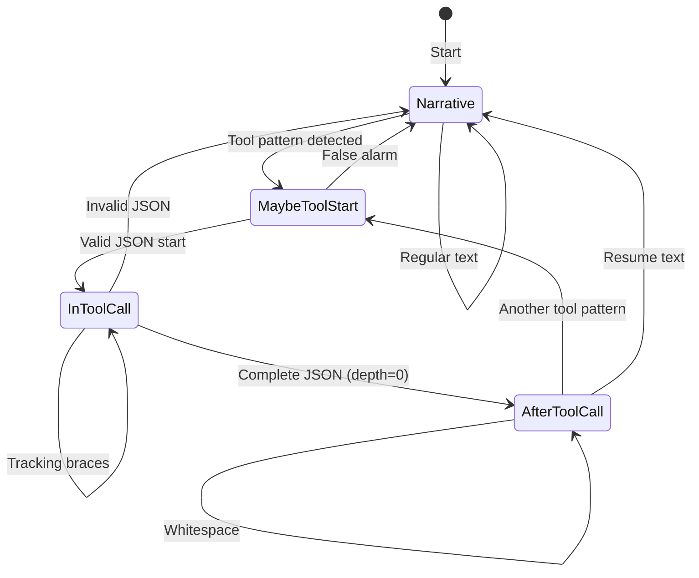
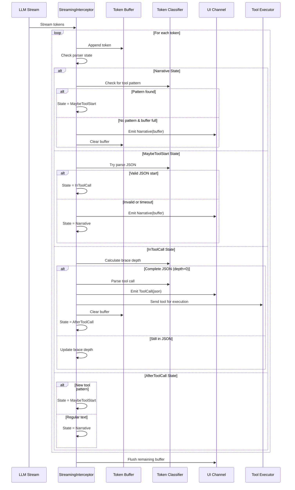
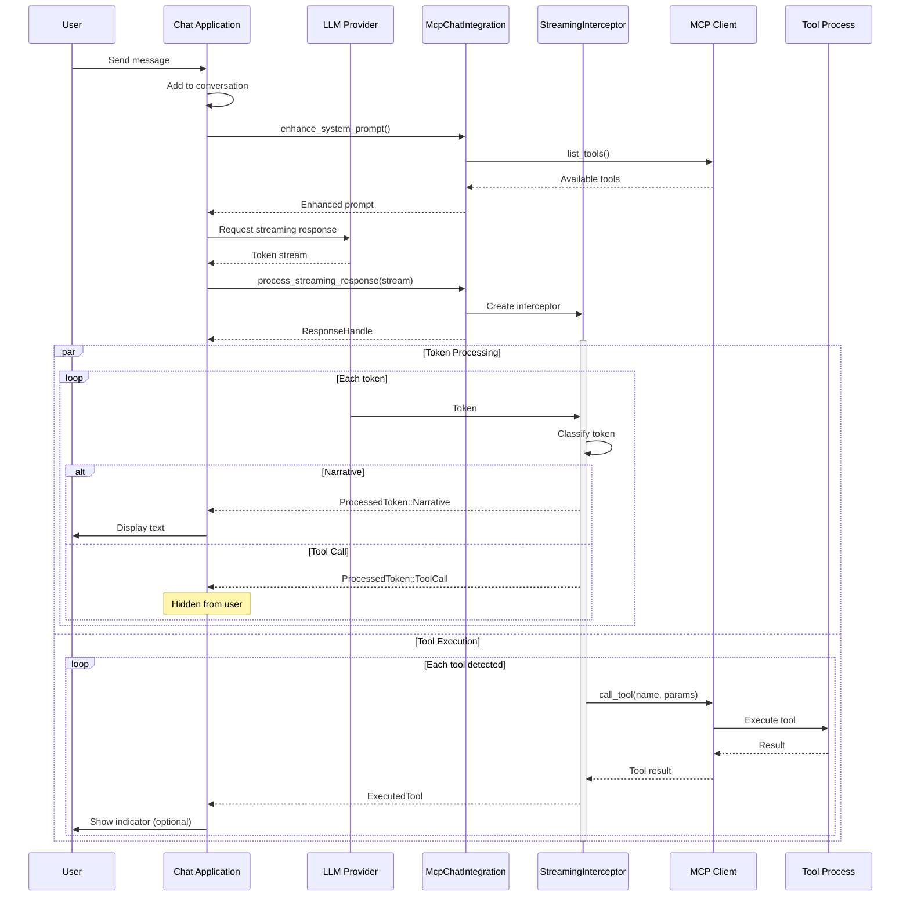

# Streaming Architecture

This document explains how the streaming interceptor identifies and extracts tool calls from LLM token streams while maintaining a smooth user experience.

## Parser State Machine

The streaming interceptor uses a state machine to classify tokens as they arrive:



## Token Flow Sequence

Here's how tokens flow through the system:



## Integration Flow

This diagram shows how the mcp-host integrates with a chat application:



## Token Classification Examples

### Example 1: Clean Tool Call

```
Input tokens: ["Let me check.\n\n", "{\"tool\": \"ls\",", " \"params\": {}", "}"]

State transitions:
1. "Let me check.\n\n" → Narrative (ends with \n\n) → Emit
2. "{\"tool\": \"ls\"," → MaybeToolStart → InToolCall (depth=1)
3. " \"params\": {}" → InToolCall (depth=2)
4. "}" → InToolCall (depth=0) → Parse & emit tool → AfterToolCall
```

### Example 2: Mixed Content

```
Input tokens: ["I'll use ", "{\"tool\":", " \"calc\", ", "\"params\":", " {\"expr\":", " \"2+2\"}}", " to help."]

State transitions:
1. "I'll use " → Narrative → Buffer
2. "{\"tool\":" → MaybeToolStart → InToolCall
3-6. Build complete JSON in buffer
7. " to help." → AfterToolCall → Narrative → Emit
```

### Example 3: False Positive

```
Input tokens: ["The JSON format ", "{ key: value } ", "is common."]

State transitions:
1. "The JSON format " → Narrative → Buffer
2. "{ key: value } " → MaybeToolStart → Invalid JSON → Narrative
3. "is common." → Narrative → Emit all as narrative
```

## Performance Considerations

1. **Buffer Management**: 
   - Default max buffer: 200 chars
   - Prevents memory growth from malformed JSON
   - Natural boundaries (newlines, sentences) trigger early emission

2. **Parallel Processing**:
   - Token classification and tool execution run concurrently
   - UI remains responsive during tool execution
   - Tool results don't block token display

3. **State Machine Efficiency**:
   - O(1) state transitions
   - Single pass through tokens
   - Minimal regex usage (only for initial pattern detection)

## Configuration Options

### Smart Buffering (Recommended)
```rust
StreamingMode::SmartBuffering { 
    max_buffer_chars: 150  // Tune based on your LLM's style
}
```
- Automatically detects and hides tool calls
- Minimal latency for narrative text
- Configurable buffer size

### Passthrough Mode
```rust
StreamingMode::Passthrough
```
- No processing overhead
- All tokens pass through immediately
- Useful when tools are handled elsewhere

### Placeholder Mode
```rust
StreamingMode::WithPlaceholders { 
    placeholder_text: "[Working...]".to_string() 
}
```
- Replace tool JSON with user-friendly text
- Tools still execute in background
- Good for polished UIs

## Error Handling

The interceptor handles various edge cases:

1. **Malformed JSON**: Treated as narrative text
2. **Incomplete streams**: Buffer flushed on stream end
3. **Network interruptions**: Partial tool calls ignored
4. **Invalid tool names**: Passed through as narrative

## Testing Strategies

1. **Unit tests**: Test state transitions with known patterns
2. **Fuzz testing**: Random token sequences shouldn't crash
3. **Integration tests**: Real LLM responses with various models
4. **Performance tests**: Measure latency and throughput